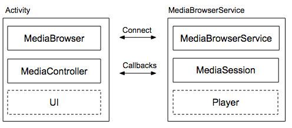
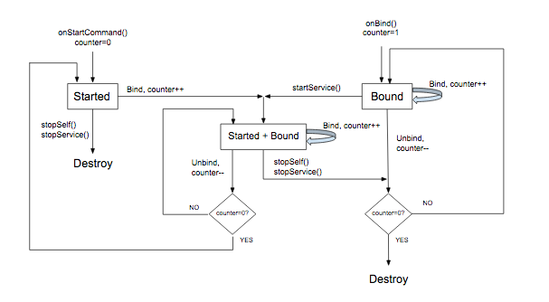
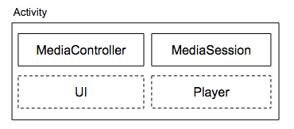

官方指南:
https://developer.android.google.cn/guide/topics/media-apps/index.html

官方Audio样例:
https://github.com/googlesamples/android-UniversalMusicPlayer

AudioDemo是UniversalMusicPlayer的简化版

Media App architectures: 

*  audio apps: a client/server design
*  video apps: a single-activity design

